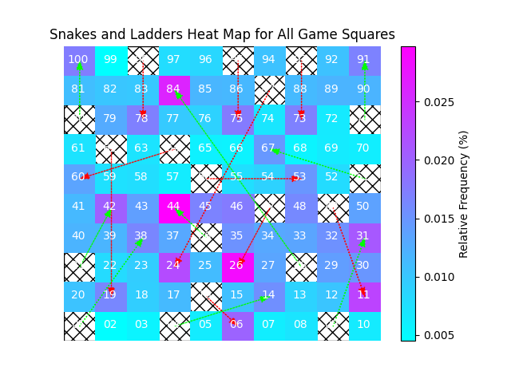
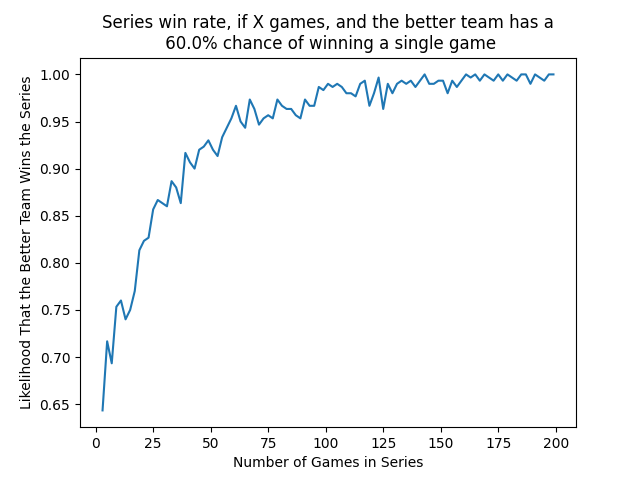

DataAnalysis
============

###Examples:

- **Heat map** showing the relative frequency of landing on a given square in the board game Snakes and Ladders. 
  *snakesAndLaddersSim.py*

  

- **Monte Carlo Simulation** of the likelihood that the better team wins a series of X games if we know the team's chances 
of winning a single game. *plotWorldSeriesSim.py*

